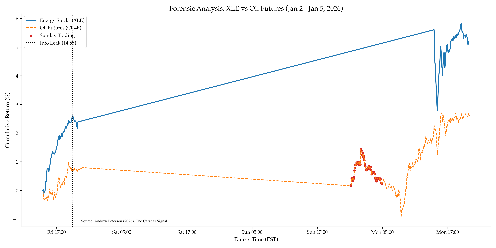

# The Caracas Signal: Replication code

Replication code for the working paper 'The Caracas Signal: Forensic Evidence of Informed Trading Ahead of Operation Stabilize' (Peterson, 2026). Includes intraday spread analysis for XLE, USO, and sector divergence metrics.


## Key Findings

1.  The Leak: Energy equities (XLE) decoupled from crude oil futures (CL=F) on Jan 2, before the operation commenced on Jan 3.
2.  The Scope (Signal): While defense stocks (ITA) rallied (+3.41%), shipping stocks (e.g. FRO) crashed (-5.68%). 
    * *Interpretation:* This divergence is consistent with the idea of some expecting a surgical, stabilizing strike (which lowers shipping risk) rather than a protracted conflict (which typically raises shipping risk premiums).

The chart below visualizes the Jan 2 Cumulative Abnormal Returns.




## Repository Structure

```text
/caracas-signal/
│
├── data/                      # Non Yahoo-finance data
├── out/                       # generated output
├── src/
│   ├── data_loader.py         # Data acquisition & caching
│   ├── plots.py            # Main analysis and plots
│   ├── historical_control.py  # Event study comparison script
│   ├── spread_distribution.py # Figure 3
│   ├── polymarket_control.py  # Figure 4 
│   └── sector_spdr_check.py  # Figure 5
└── requirements.txt
```


## Replication


```bash
pip install -r requirements.txt


# create intraday caches (subject to Yahoo limits)
python src/data_loader.py

# run analysis and generate plots
python run_all.py
```


## Citation and License
If you use this code or data, please cite:
> Peterson, Andrew J. (2026). *The Caracas Signal: Forensic Evidence of Informed Trading Ahead of Operation Stabilize*. Working Paper.

This repository is dual-licensed:

1. Code: The source code in this repository is licensed under the MIT License. You are free to use, modify, and distribute the code as long as the copyright notice is preserved.
2. Research Assets: The figures, datasets, and the paper ("The Caracas Signal") are licensed under CC BY 4.0. You are free to share and adapt these materials, but you must give appropriate credit to the author (Andrew J. Peterson) and provide a link to the original work.

See `LICENSE` for the full MIT text and [creativecommons.org](https://creativecommons.org/licenses/by/4.0/) for the CC BY 4.0 terms.


## Disclaimer

This report is for academic and informational purposes only. No content herein constitutes financial advice or an accusation of criminal conduct.
